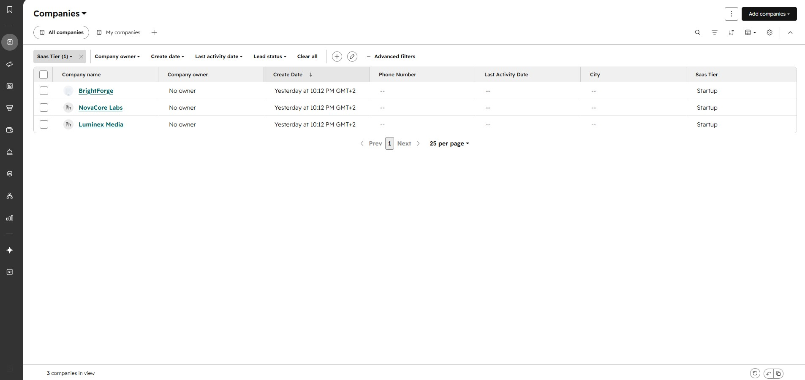
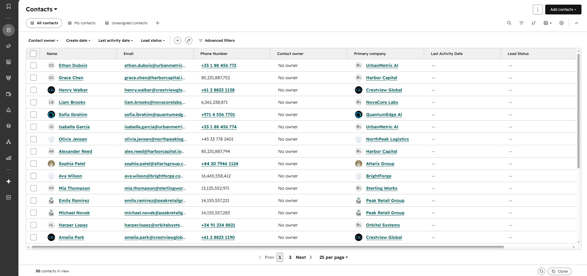
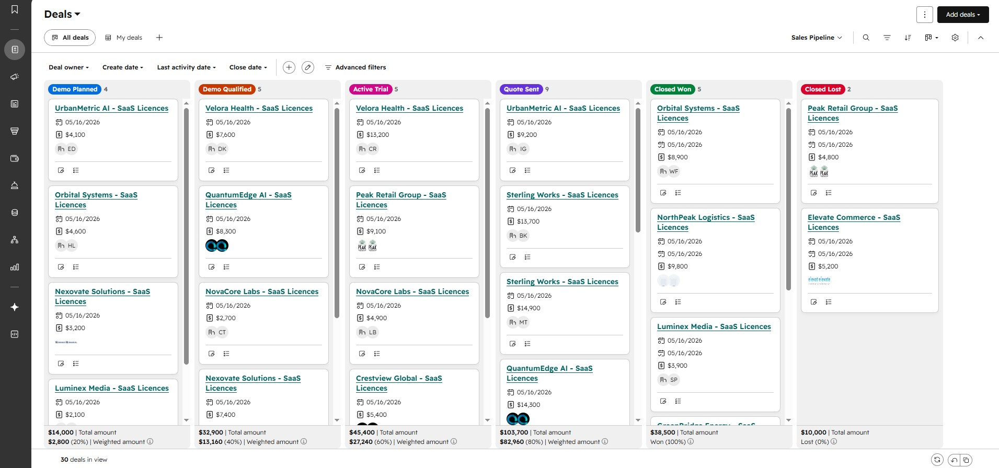
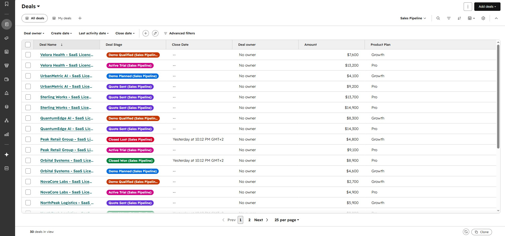
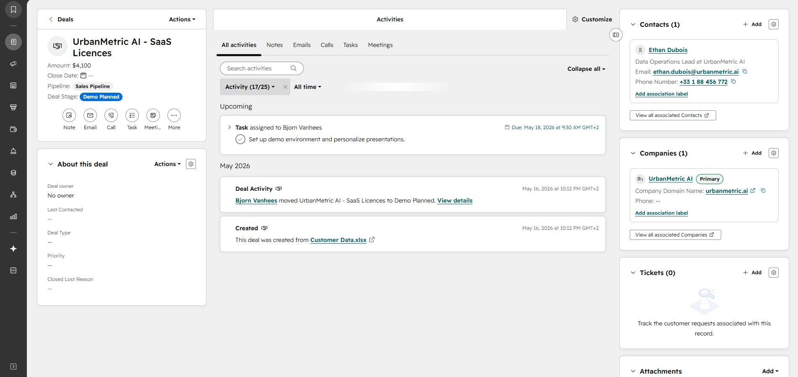

HubSpot CRM Architecture for SaaS (Case Study)
Project Type: CRM Design, Architecture & Data Migration

Platform: HubSpot (Free Tier)

Goal: Gather fragmented data into a streamlined, functional CRM suited for a growing B2B SaaS business.

1. Brief
   
A fast-growing SaaS business was managing its customer data, active sales deals, and product preferences across fragmented Excel spreadsheets. This caused several operational issues:

No Single Source of Truth: Sales reps lacked a unified 360-degree view of contacts and companies.

Missed Opportunities: Sales demos were not properly tracked or followed up on.

Lack of Product Insight: It was impossible to see at a glance which leads were interested in which software tiers (Startup, Professional, or Enterprise).

My Goal: Design and configure a scalable HubSpot CRM instance that professionalizes the sales process—achieved entirely within the functional boundaries of HubSpot's Free Tier.

2. Solution
   
To solve these challenges, I built a tailored CRM infrastructure using the following steps:

2.1 Data Cleaning & Import Strategy

I consolidated raw data from multiple sources into a single, clean import file and Executed a unified import mapping Contacts, Companies, and Deals simultaneously to ensure all records were automatically associated upon   import.

2.2 Custom SaaS Sales Pipeline

I replaced HubSpot's default pipeline stages with a realistic SaaS sales lifecycle:

Demo Planned ➔ Demo Qualified ➔ Active Trial ➔ Quote Sent ➔ Closed Won / Closed Lost

2.3 Custom Data Architecture

I created a custom dropdown property (Product Plan) to track product intent right on the deal level. This allows the team to segment deals based on whether they belong to the Startup, Professional, or Enterprise package.

2.4 Dashboard & View Optimization

Since the Free Tier restricts advanced card customization on the board view, I optimized the Deals List View using Edit Columns. A sales manager can now view the Deal Name, Stage, Total Amount, and the specific Product    Plan in a single glance without clicking through.

3. The Results
   
Unified Customer Profiles: Every contact, company, deal history, and open task is now perfectly mapped on a single screen.

Structure: Introducing dedicated Sales Tasks gives reps a clear daily queue, eliminating forgotten follow-ups.

SaaS-Optimized Tracking: The sales team can now track critical software trial periods (Active Trail), reducing retention risks during the sales cycle.

Highly Cost-Efficient: Maximum functionality was extracted from the HubSpot Free Tier, proving that a robust CRM architecture can be built without thousands of dollars in upfront license fees.
